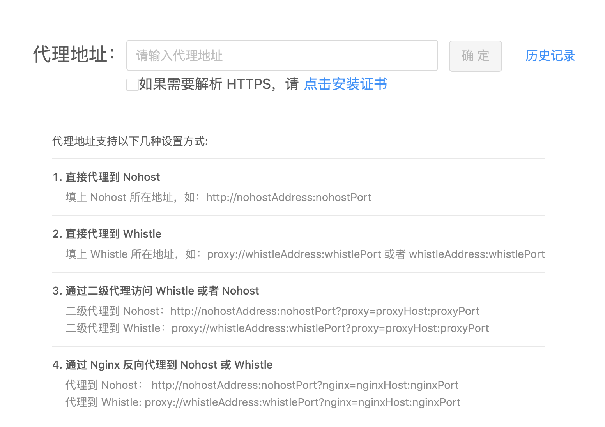
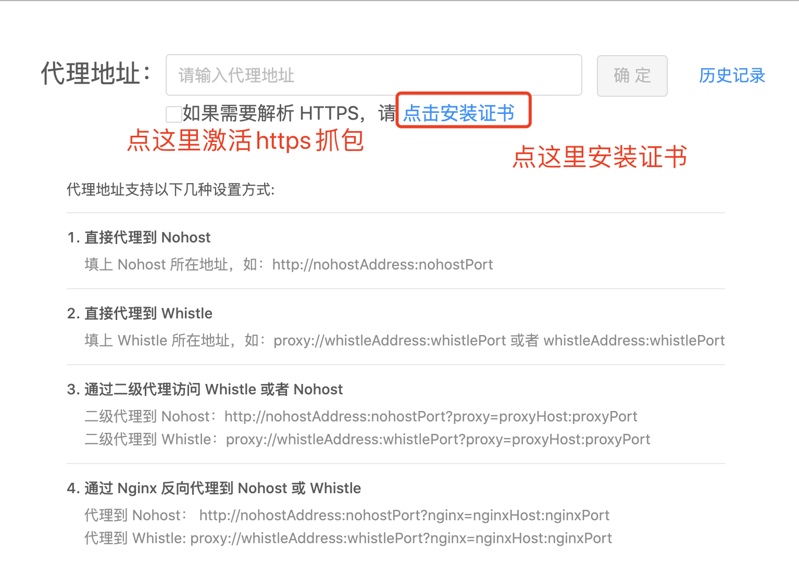

# whistle.proxy-settings

通用设置 Nohost/Whistle 代理的whistle插件。设置Nohost/Whistle的地址，既可快捷使用。

## 如何使用

1. 安装
   > npm i -g whistle.proxy-settings

2. 代理配置

   点击`设置代理`按钮，参照指引，按照对应的格式设置代理
   > whistle: `proxy://whistleAddress:whistlePort` 或者 `whistleAddress:whistlePort`

   > Nohost: `http(s)://nohostAddress:nohostPort`

   

3. https抓包配置
   
   插件默认不抓取https请求，因为https请求需要信任根证书。所以需要抓取https请求，请点击激活并安装证书
   

> 验证配置是否正确，访问`本地whistle地址/whistle.proxy-settings/cgi-bin/rules`，即可看到所有动态生成的规则

## 开发

### 本地开发：
插件可以先本地开发和验证功能，确定没问题之后在接入到whistle插件中
1. 安装依赖
   > npm i

2. 构建前端页面
   > npm run dev

3. 启动node服务
   > npm run start

4. 访问127.0.0.1:9999

### whistle插件
参照：https://wproxy.org/whistle/plugins.html
